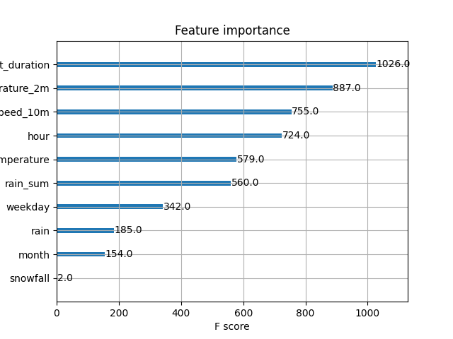

# Project: Predicting Bike Availability in Dublin

## Introduction

This project focuses on predicting the number of bikes available at a bike share service in Dublin. The goal is to forecast bike availability based on the weekday, time of day, and weather conditions. It uses a decision tree algorithm, specifically XGBoost Regressor, to predict bike availability. The data is stored in Hopsworks feature groups, which are updated with new data every day in order to 1. make new predictions based on the weather forecast, and 2. monitor the performance of the model. A user interface has been created to display this forecast and monitoring graph.

## Data

The dataset used for this project is the [bike-sharing-history dataset by MaxHalford](https://github.com/MaxHalford/bike-sharing-history), available on GitHub. It includes the number of bikes available at various stations in different cities, including Dublin, updated about every 15 minutes. Weather data has been sourced from [open-meteo](https://open-meteo.com/).

To ensure the model is trained on consistent and manageable data, I pick out only one data point per hour. This is done in hopes of reducing the noise and variability in the data, making the model more robust and efficient.

## Methodology and Algorithm

1. **Data Extraction**: The notebook `1. git_to_csv.ipynb` extracts bike-sharing data from the GitHub repository by looping through the commits and then converts it into CSV files. This is done so that one does not need to download the data each time they want to rerun the pipeline (which is mostly useful in debugging situations). Extracting about one year of data takes approximately 30 to 40 minutes.
2. **Backfill Historical Data**: The notebook `2. csv_to_hopsworks_backfill.ipynb` reads the historical bike data from CSV files and inserts it into a Hopsworks feature group called 'bike_data'. It also reads data from the open-meteo API and inserts it into the weather feature group called 'weather_data'.
3. **Daily Data Pipeline**: The notebook `3. git_to_hopsworks_daily_pipeline.ipynb` fetches the latest bike data from the GitHub repository and updates the Hopsworks feature groups daily. It also fetches the latest weather forecast data from the open-meteo API and updates the weather feature group in the same manner, so that the inference notebook can use the latest data to make predictions.
4. **Model Training**: The notebook `4. model_training_pipeline.ipynb` trains the XGBoost model using the historical data stored in Hopsworks and saves the model for later use. It also evaluates the model using the test data.
5. **Inference**: The notebook `5. inference.ipynb` performs inference using the trained model and the latest forecasted data to predict bike availability. It plots a graph of the predictions for the future and compares historical predictions with the actual bike availability to show the model's performance.

The system is designed to be run daily, with the daily pipeline fetching the latest data and updating the feature groups, and the inference notebook making predictions based on the latest data. This is done using GitHub Actions, showing the results in the user interface, also on GitHub.

## Results

The model was evaluated on test data separate from the training data, picked randomly from the dataset. The model achieved an **R2 score of 0.9191**, meaning it can explain 91.67% of the variance in the data. The **mean squared error was 14.14**, which is harder to interpret but gives an idea of how far off the predictions are from the actual values.

The model was then used to make predictions on the latest data, and the results were plotted in a graph. At the time of writing, the model has ...

### Feature Importance



### Forecast


### Hindcast


## Changing the city and expanding to multiple stations

As the bike-sharing-history dataset contains many more cities than just Dublin, it is possible to change the city for which the model is trained and make predictions. This can be done by changing the `city` variable in the notebooks. Sometimes, the JSON file containing the stations for a city is different from the one for Dublin, so it might be necessary to change some JSON parsing and filenames in the code, but this should be relatively easy to do.

To expand the model to multiple stations, one can simply create a loop that trains a model for each station in the city. This would require some changes to the code but is definitely doable. It was decided not to do this for this project, as Hopsworks only allows you to create a limited number of feature groups and models.

## How to run the code

#### 1. Creating a virtual environment and installing the required packages
I used conda to create a virtual environment for this project. You can create a new environment using the following command:
```
conda create --name bike-sharing python=3.10
conda activate bike-sharing
```

Then, install the required packages using the following command:
```
pip install -r requirements.txt
```

#### 2. Create an .env file 
In the root directory, create a file called `.env` and add your Hopsworks API key named HOPSWORKS_API_KEY.

#### 3. Clone the bike-sharing-history repository

Clone the repository [bike-sharing-history](https://github.com/MaxHalford/bike-sharing-history) to your local machine. The code is capable of downloading it itself, but I have experienced that cloning it manually is way faster.

Run the following commands from the root of your repo:
```
mkdir bike_data
cd bike_data
git clone https://github.com/MaxHalford/bike-sharing-history
```

#### 4. Run the notebooks

Run the notebooks in their given orders. The notebooks are designed to be run in sequence, as they depend on each other. Sometimes you have to wait a bit between finishing one notebook and starting the next, as the data is being processed and uploaded to Hopsworks.

#### 5. Check the results

After running the notebooks, you can check the predictions in the inference notebook!

#### 6. Set up the daily pipeline

The daily pipeline can (on Windows) be set up using the Task Scheduler. You can create a new task that runs bike-availability-dayly.bat every day at a given time. The bat file runs the notebooks and pushes the results to GitHub.

Note that you need to change the path to conda in the bat file to the path on your machine.